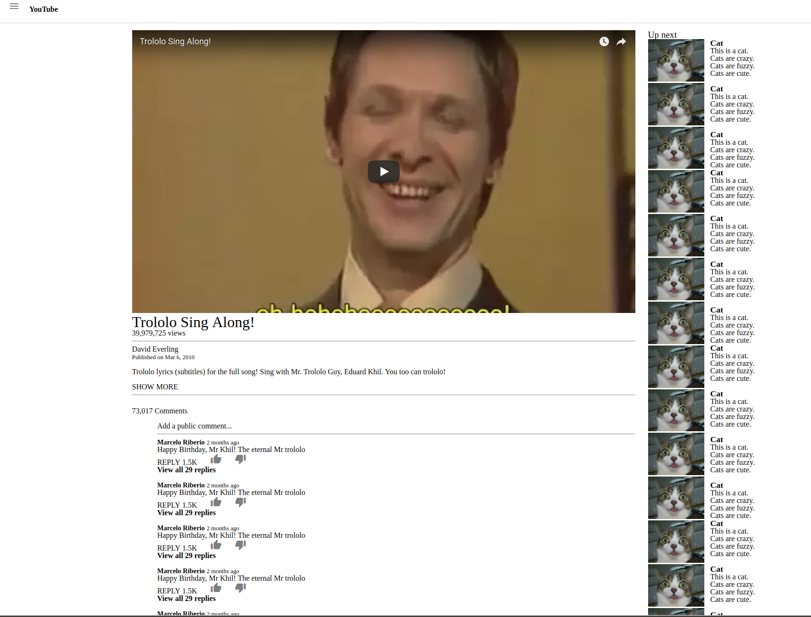

# YouTube Video Page Project

This purpose of this project was to practice embedding images/video in HTML/CSS by implementing the [Youtube Video Page](https://www.youtube.com/watch?v=dQw4w9WgXcQ)

This is a project from [The Odin Project](https://www.theodinproject.com/lessons/embedding-images-and-video).

## Pre-Project Thoughts

No particular thoughts going in.
I just hope all this HTML/CSS doesn't make me rusty in Rails.

## Post-Project Thoughts

I didn't spent much time on the CSS, obviously, because this section is about HTML structure and embedding media.
I did ensure to properly embed both videos/images and follow proper HTML structure by thinking about what meaning I was imbuing content with as I surrounded them with tags.
Both HTML and CSS were validated using W3C's validators.
It was an easy project.
Probably took around 20 minutes.

One thing I'd like to comment on is how quickly this took compared to that first [Google Homepage](https://github.com/JonathanYiv/google-homepage) and [Google Searchpage](https://github.com/JonathanYiv/google-searchpage) project three months ago back in [Web Development 101](https://www.theodinproject.com/courses/web-development-101).
Those each took me a day.
